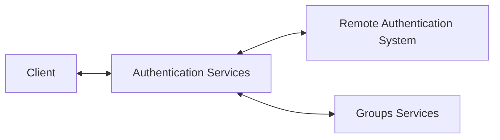
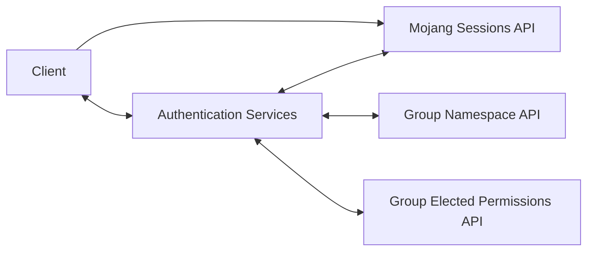
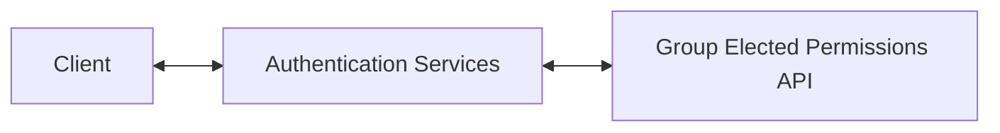

# Argus Authentication Services

## Overview

These services are used for authenticating a user and issuing a token which can
be used by other Argus services to verify permissions to certain resources.

## High Level Architecture

The general architecture for the authentication service is as follows:

### General Authentication Steps
1) Client connects to the Authentication Service and provides required info
   to verify identity of the user with a Remote Authentication System.
2) Information provided by the client is checked against a Remote
   Authentication System.
3) If the remote system verifies the identity of the user, then the provided
   identity is used to reference elected permissions from the Group Services.
4) Both an access token and a refresh token are provided to the user which can
   be used by other Argus services for resource authorization and for generating
   additional access tokens to avoid having to hit external APIs to re-authenticate.

### Mojang Authentication Path

### Mojang Authentication Steps
1) Client invokes the Minecraft Join API of the Mojang Sessions API with:
    - Their `access token`
    - `UUID` of the active profile
    - One-time auto-generated `server hash`
2) Client submits the `server hash` and the `username` of the current profile
   to Argus Authentication Services.
3) Authentication Services invokes the Minecraft Has Joined API of the
   Mojang Sessions API with the client provided `server hash` and `username`.
4) If the Mojang Sessions API returns back a valid response that contains the
   `id` and `name` of the user, then the appropriate namespace is retrieved
   from the Namespace API of the Argus Groups Service using a user-supplied
   target server address.
5) If the Namespace API resolves to a valid Namespace, then this is used to
   construct a token with a valid UPN for retrieving permissions. This token
   will also be given to the client to be used as a refresh token.
6) Using the newly generated token, permissions are retrieved from the
   Elected Permissions API of the Argus Groups Service.
7) With the permissions, a new token is generated which contains the currently
   elected resources for the user. This access token and the refresh token are
   sent to the client for usage in further service calls.

### Refresh Authentication Path

### Refresh Authentication Steps
1) Client submits its refresh token to Authentication Services
2) Authentication Services verifies the token is, in fact, a refresh token by
   verifying there are no group claims attached.
3) Using the refresh token, permissions are retrieved from the Elected Permissions
   API of the Argus Groups Service.
4) With the permissions, a new token is generated which contains the currently
   elected resources for the user. The newly generated access token is sent to the
   client for usage in further service calls.
