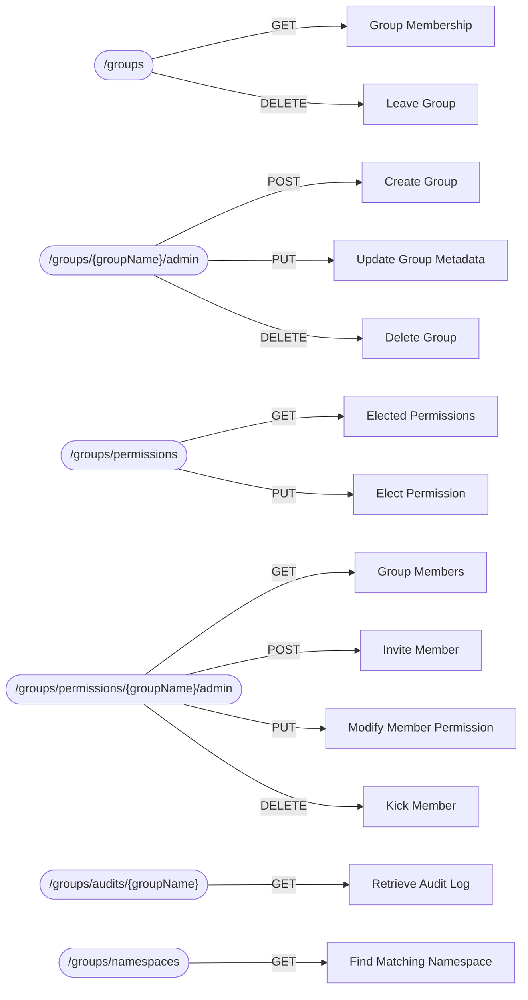

# Argus Group Services

## Overview

These services are used for group and permission management. Users can create,
update, delete groups. Permissions can be assigned to users which allow them
to interact with the group in certain ways.

Groups are namespace specific and can have the same name across namespaces.

Namespaces are meant as a representation to separate out groups across different
end servers that Argus may be used with. This is useful so a new instance does
not need to be created specifically for different Minecraft servers.

## High Level Service Catalogue

### /groups

Services under this endpoint are used by everyone and provide ways for the user
to retrieve what groups they have membership with and to leave groups if
desired.

A valid token is **required** to access these services.

### /groups/{groupName}/admin

Services under this endpoint are used for management of groups. This includes
creation, modifying and deletion of groups. Users must have `ADMIN` permission
with the group to perform updates. Only the owner of the group can delete it.
Anyone can create a group, but only a certain amount of groups can be created
per user per namespace.

A valid token is **required** to access these services.

### /groups/permissions

Services under this endpoint are used by users to elect the permission level
in which they would like to interact with the group. The primary use-case is
to provide users a way to transmit data only to groups they want to without
having to leave the group.

A valid token is **required** to access these services.

### /groups/permissions/{groupName}/admin

Services under this endpoint are used for management of members of a group.
This includes retrieving all members of a group, inviting new members,
changing the permission level of members, and removing them from the group.
All interactions with these services require the user to have `ADMIN`
permission with the group. Only the owner of the group can assign the
`ADMIN` permission level.

A valid token is **required** to access these services.

### /groups/audits/{groupName}

Services under this endpoint are used for interacting with the audit log.
This log contains information about all actions that were performed within
the group. The log can only be written to by other services to indicate
any notable changes to members or the group. The log cannot be purged by
users and will only be deleted once the group is deleted.

All interactions with these services require the user to have `ADMIN`
permission with the group.

A valid token is **required** to access these services.

### /groups/namespaces

Services under this endpoint are used for interacting with namespaces.
This includes retrieving a valid namespace given a user-provided mapping.
Generally, these endpoints are not of interest to the end user and are
primarily meant for internal services.

A valid token is **not required** to access these services.
