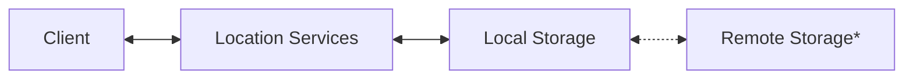
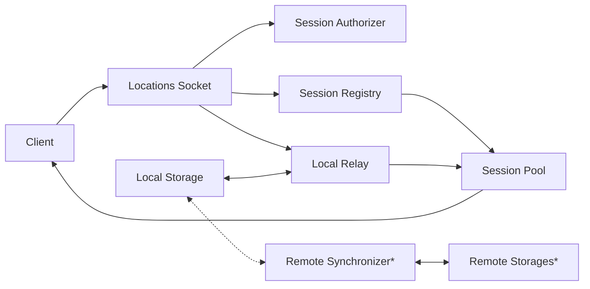

# Argus Location Services

## Overview

These services are used for storing and relaying location information across
groups of users. These groups are configured by the creator and admins of the
group to set access permissions for individual users. Users can participate in
location groups in two ways:

- Read
    - User is able to read location messages from the group(s) which they have
      this permission level.
- Write
    - User is able to write location messages to the group(s) which they have
      this permission level.

Users may have different combinations of read/write permissions for different
groups. By default, users will not be enrolled in sending or receiving any
messages from the group(s) and they must manually enroll after being added to
the group.

Permissions are determined by the group claims of a JWT attached to the request
via the `Authorization` header using the `Bearer` scheme. Users may select
enrollment and the claimed groups within the JWT will reflect this upon the
issuance of a new token.

## High Level Architecture

### Overarching Component Interactions

**Important**: Access to remote storages is only enabled in **scale**
configuration.

### Detailed Component Interactions

**Important**: Access to remote storages is only enabled in **scale**
configuration.

### Custom Configuration

`scale`
may be used as the Quarkus profile in order to enable syncing across multiple
instances via the `Remote Synchronizer`

`group.locations.local.storage.expiration.minutes`
may be used to set the time from write expiration for which location data
will be saved and be available to replay for 'late joining' users.

`group.locations.relay.remote.publish.delay.millis`
may be used to set the delay for which all location messages are published
to remote instances.
